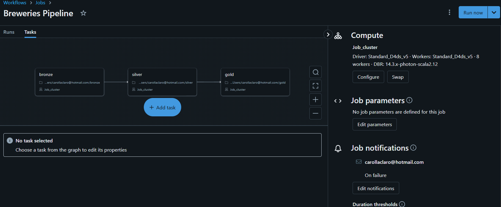

# case_breweries

Para esse case, optei por utilizar o ambiente do Databricks para realizar tanto os códigos das diferentes layers, quanto o workflow para o job orchestration através de um job_cluster, que é bem performático.
No workflow, coloquei as tasks em dependência uma a outra, e executando os notebooks referenciados para cada tabela (bronze, silver e gold).
Utilizei PySpark em todas as transformações, e SQL para consultar as tabelas e criar os schemas.
Também dei preferência por criar tabela delta ao invés de parquet, já que elas são mais performáticas. 

Na bronze, mantive o JSON como na origem.
Na silver, apliquei o hash em colunas que poderiam conter dados sensíveis (website, street, phone e postal_code).
Na gold, fiz a agregação solicitada mapeando as regiões disponíveis.

Para o data quality, eu colocaria uma etapa depois de cada task (bronze, silver e gold) com o nome de layer_monitoring. 
Para o bronze, faria a análise se o json contém ainda os mesmos campos. Caso contrario, deixaria como erro a task, que travaria todo o workflow, notificando o owner pelo Job Notifications.
Para a silver, deixaria o data quality nos tipos e dados de cada coluna, olhando o seu nome, e se há alguma linha com ID nulo.
Para a gold, faria o mesmo que a silver, mas olharia se há alguma região nula.

Todos os job monitoring poderiam ter a notificação no email, ou em algum canal de slack que o time tivesse.

Segue imagem do meu job workflow no databricks:

Se for necessário, posso compartilhar o meu ambiente/notebook databricks :) 